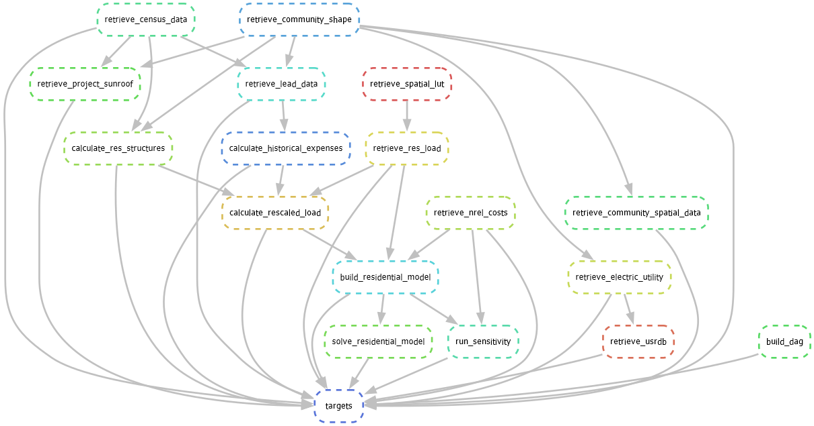

# 2024 Kansas City Analysis
This repository holds analysis for the energy system in Kansas City, Kansas. Located in Wyandotte County, Kansas.

## Workflow

The flow of data through the modeling process is shown in the graph below.



There are a few categories of steps:
* **Retrieve**: In a `retrieve` step, data are primarily downloaded and lightly processed (e.g., ensuring good formatting and data types).
* **Calculate**: In a `calculate` step, data are transformed through some calculation.
* *place holder for future additions*


## Steps

### `retrieve_census_data`
In this step, data from the U.S. Census Bureau are queried. The datasets gathered, here, are:
* Total population and
* the number and types of residential building units.

### `retrieve_armourdale_shape`
In this step, the "shape" of the community of interest is retrieved. This shape can be used as a cut-out
to subset other geospatial data later.

> [!NOTE]
> This data is specific to the particular community of Armourdale in Kansas City, Kansas. If you 
> wish to model a different community, should omit this step or replace it with a different shape.
> For example, by specifying a few census tracts.

### `retrieve_spatial_lut`
This step downloads the spatial lookup table (LUT) for NREL's ResStock datasets. The spatial LUT 
cross references census tracts, counties, and states with public use microdata areas (PUMAs). As
well as how the data are stored within NREL's models.

### `retreive_res_load`
Simulated building load data is collected from NREL's ResStock database in this step. Currently, 
the data collected are aggregated building data for the building types defined in the `config.yml` file.
Future versions may include an option to specify individual buildings.

# Installation

## Requirements

* `git` - version control software
    * [Windows Installation instructions](https://git-scm.com/download/win)
    * [MacOS Installation instructions](https://git-scm.com/download/mac)
    * [Linux Installation instructions](https://git-scm.com/download/linux)
* Python installed with either `conda` or `mamba`(recommended)
    * Download `mamba` installer [here](https://github.com/conda-forge/miniforge).
    * 'anaconda' ('conda') installation instructions [here](https://docs.anaconda.com/anaconda/install/windows/).

> [!NOTE]
> Make sure you add Python to PATH during installation.

## Installation Steps
0. Open command prompt or terminal window. Copy and paste the following commands.

1. Clone the repository

```bash
git clone https://github.com/ucsusa/2024-kansas-city-analysis.git
```

2. Set up the environment

```bash
cd 2024-kansas-city-analysis
mamba env create  # mamba and conda may be used interchangeably, here
mamba activate kansas-city
```

3. Creating the `.env` file

Users should copy the `.env.template` file into a new file simply called `.env`.
This file contains "secret" information, such as API keys, emails, and other data
that should remain local. In order to run the current model, users must have API keys
from the following organizations:

* [U.S. Census API](https://api.census.gov/data/key_signup.html)

These keys may be added directly to the `.env` file.    

## Running the model 

This project uses the workflow management tool, `snakemake`, to create a reproducible data pipeline.
Running the command

```bash
snakemake --cores=1
```

will run the workflow illustrated in the directed acyclic graph (DAG) shown below.
